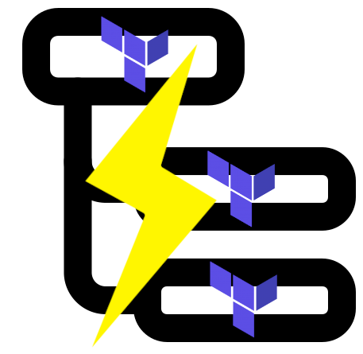

# terrafoudre



Find if your terraform resources are used in another terraform state

## Prerequisities

terrafoudre only works with state format from `terraform show -json` (as explained [here](https://developer.hashicorp.com/terraform/language/state#format)).

You should consider producing and storing `terraform show -json` after each successful `terraform apply`.

All states that needs to be analyze by terrafoudre must be accessible in filesystem.

## Configuration

Main idea of terrafoudre is to check if given values from a source state are present in another state to know if there is a dependency.
The first step is to define primary keys for your source resources, like `id` for example, but depending on provider or resource, it may be `name`, or `arn`, or...

It is your job to define depending on provider or resource what key to choose:
- if you want by default to look for `id` keys, then you should put it in `defaultKeyMatcher`
- if you want to look for `arn` keys with provider `aws`, then you should put it in `providerMatchers`
- if you want to look for `name` keys with provider `aws` and resource type `aws_iam_role`, then you should put it in `typeMatchers`

`typeMatcher` take precedence on `providerMatchers` that take precedence on `defaultKeyMatcher`

Keys selected with previous matchers are excluded from destination state managed resources (!= data): if an `aws_iam_role` has `name=george` in a source state, we doesn't try to match it with other `aws_iam_role` `name` key, it could only mean that this role exists in 2 different accounts for example, without dependencies.

## Usage 

```sh
Usage of terrafoudre:
  -config string
        Path to config (default "test/config-full.yaml")
  -debug
        Set log level to debug
  -destinationStates string
        Path to json states directory that contains destination resources (default "test/states/")
  -sourceState string
        Path to json state that contains source resources (default "test/states/source.json")
```


##### Credits

<font size=1>

Dependency by Meko from [Noun Project](https://thenounproject.com/browse/icons/term/dependency/)

thunder by Mansion@design from [Noun Project](https://thenounproject.com/browse/icons/term/thunder/)

Terraform logo from [Terraform](https://www.terraform.io/)

</font>
